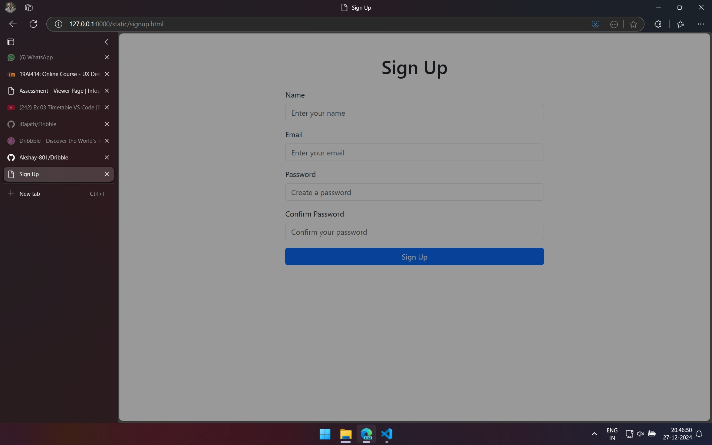

# Project Responsive Web Design using Bootstrap
## Date: 27.12.2024

## AIM:
To create a simplified clone of Dribbble (https://dribbble.com/) landing page.


## DESIGN STEPS:

### Step 1:
Clone the repository from GitHub.

### Step 2:
Create Django Admin project.

### Step 3:
Create a New App under the Django Admin project.

### Step 4:
Insert the necessary CSS and JavaScript files as external in order to use Bootstrap.

### Step 5:
Create a HTML file and include the needed Bootstrap components.

### Step 6:
Publish the website in the LocalHost.

## PROGRAM :

### index.html
```
<!DOCTYPE html>
<html lang="en">
<head>
  <meta charset="UTF-8">
  <meta name="viewport" content="width=device-width, initial-scale=1.0">
  <title>Wally</title>
  <link href="https://cdn.jsdelivr.net/npm/bootstrap@5.3.0/dist/css/bootstrap.min.css" rel="stylesheet">
  <script src="https://cdn.jsdelivr.net/npm/bootstrap@5.3.0/dist/js/bootstrap.bundle.min.js"></script>
</head>
<body>
  <div class="container">
    <nav class="navbar navbar-expand-lg navbar-light bg-inverse">
      <a class="navbar-brand" href="index.html">Wally</a>
      <button class="navbar-toggler" type="button" data-bs-toggle="collapse" data-bs-target="#navbarNav" aria-controls="navbarNav" aria-expanded="false" aria-label="Toggle navigation">
        <span class="navbar-toggler-icon"></span>
      </button>
      <div class="collapse navbar-collapse" id="navbarNav">
        <ul class="navbar-nav ms-auto">
          <li class="nav-item">
            <a class="nav-link" href="shots.html">Shots</a>
          </li>
          <li class="nav-item">
            <a class="nav-link" href="designers.html">Designers</a>
          </li>
          <li class="nav-item">
            <a class="nav-link" href="community.html">Community</a>
          </li>
          <li class="nav-item">
            <a class="nav-link" href="jobs.html">Jobs</a>
          </li>
          <li class="nav-item">
            <a class="nav-link btn btn-primary text-white px-3" href="signup.html">Sign Up</a>
          </li>
        </ul>
      </div>
    </nav>
  </div>

  <div class="container my-5 text-center">
    <h1 class="mb-3">What are you working on?</h1>
    <p>Wally is the best website for wallpaper and covers.</p>
    <a href="shots.html" class="btn btn-primary">Explore Shots</a>
    <a href="signup.html" class="btn btn-secondary">Sign Up</a>
  </div>

  <div class="container my-5">
    <div class="row g-4">
      <div class="col-md-4">
        <div class="card">
          
          <div class="card-body">
            <h5 class="card-title">Tony Stark</h5>
            <p class="card-text">8k, 4k, 2k, 1080p, 720p...</p>
            <a href="shots.html" class="btn btn-primary">View More</a>
          </div>
        </div>
      </div>
      <div class="col-md-4">
        <div class="card">
          
          <div class="card-body">
            <h5 class="card-title">Lamborghini</h5>
            <p class="card-text">8k, 4k, 2k, 1080p, 720p...</p>
            <a href="shots.html" class="btn btn-primary">View More</a>
          </div>
        </div>
      </div>
      <div class="col-md-4">
        <div class="card">
          
          <div class="card-body">
            <h5 class="card-title">Bugatti</h5>
            <p class="card-text">8k, 4k, 2k, 1080p, 720p...</p>
            <a href="shots.html" class="btn btn-primary">View More</a>
          </div>
        </div>
      </div>
      <div class="col-md-4">
        <div class="card">
          
          <div class="card-body">
            <h5 class="card-title">Custom PC builds</h5>
            <p class="card-text">8k, 4k, 2k, 1080p, 720p...</p>
            <a href="#" class="btn btn-outline-primary">View More</a>
          </div>
        </div>
      </div>
      <div class="col-md-4">
        <div class="card">
          
          <div class="card-body">
            <h5 class="card-title">DC Superheroes</h5>
            <p class="card-text">8k, 4k, 2k, 1080p, 720p...</p>
            <a href="#" class="btn btn-outline-primary">View More</a>
          </div>
        </div>
      </div>
      <div class="col-md-4">
        <div class="card">
          
          <div class="card-body">
            <h5 class="card-title">Spider-Man</h5>
            <p class="card-text">8k, 4k, 2k, 1080p, 720p...</p>
            <a href="#" class="btn btn-outline-primary">View More</a>
          </div>
        </div>
      </div>
    </div>
  </div>

  <footer class="bg-light py-3 mt-5">
    <div class="container text-center">
      <p class="mb-0">S Rajath - 2490186</p>
    </div>
  </footer>
  </body>
</html>
```

### shots.html

```
<!DOCTYPE html>
<html lang="en">
<head>
  <meta charset="UTF-8">
  <meta name="viewport" content="width=device-width, initial-scale=1.0">
  <title>Shots</title>
  <link href="https://cdn.jsdelivr.net/npm/bootstrap@5.3.0/dist/css/bootstrap.min.css" rel="stylesheet">
  <script src="https://cdn.jsdelivr.net/npm/bootstrap@5.3.0/dist/js/bootstrap.bundle.min.js"></script>
</head>
<body>
  <div class="container my-5">
    <h1 class="text-center mb-4">Shots</h1>
    <div class="row g-4">
      <div class="col-md-4">
        <div class="card">
          
          <div class="card-body">
            <h5 class="card-title">Shot 1</h5>
            <p class="card-text">High-resolution wallpapers and more.</p>
            <a href="#" class="btn btn-primary">View Details</a>
          </div>
        </div>
      </div>
      <div class="col-md-4">
        <div class="card">
          
          <div class="card-body">
            <h5 class="card-title">Shot 2</h5>
            <p class="card-text">Exclusive designs for creatives.</p>
            <a href="#" class="btn btn-primary">View Details</a>
          </div>
        </div>
      </div>
      <div class="col-md-4">
        <div class="card">
          
          <div class="card-body">
            <h5 class="card-title">Shot 3</h5>
            <p class="card-text">Explore our latest additions.</p>
            <a href="#" class="btn btn-primary">View Details</a>
          </div>
        </div>
      </div>
      <div class="col-md-4">
        <div class="card">
          
          <div class="card-body">
            <h5 class="card-title">Custom PC builds</h5>
            <p class="card-text">8k, 4k, 2k, 1080p, 720p...</p>
            <a href="#" class="btn btn-outline-primary">View More</a>
          </div>
        </div>
      </div>
      <div class="col-md-4">
        <div class="card">
          
          <div class="card-body">
            <h5 class="card-title">DC Superheroes</h5>
            <p class="card-text">8k, 4k, 2k, 1080p, 720p...</p>
            <a href="#" class="btn btn-outline-primary">View More</a>
          </div>
        </div>
      </div>
      <div class="col-md-4">
        <div class="card">
          
          <div class="card-body">
            <h5 class="card-title">Spider-Man</h5>
            <p class="card-text">8k, 4k, 2k, 1080p, 720p...</p>
            <a href="#" class="btn btn-outline-primary">View More</a>
          </div>
        </div>
      </div>
    </div>
  </div>
</body>
</html>
```

### designers.html

```
<!DOCTYPE html>
<html lang="en">
<head>
  <meta charset="UTF-8">
  <meta name="viewport" content="width=device-width, initial-scale=1.0">
  <title>Designers</title>
  <link href="https://cdn.jsdelivr.net/npm/bootstrap@5.3.0/dist/css/bootstrap.min.css" rel="stylesheet">
  <script src="https://cdn.jsdelivr.net/npm/bootstrap@5.3.0/dist/js/bootstrap.bundle.min.js"></script>
</head>
<body>
  <div class="container my-5">
    <h1 class="text-center mb-4">Featured Designers</h1>
    <div class="row g-4">
      <div class="col-md-4">
        <div class="card text-center">
          <div class="card-body">
            <h5 class="card-title">Jane Doe</h5>
            <p class="card-text">Expert in UX/UI design.</p>
            <a href="#" class="btn btn-primary">View Profile</a>
          </div>
        </div>
      </div>
      <div class="col-md-4">
        <div class="card text-center">
          <div class="card-body">
            <h5 class="card-title">John Smith</h5>
            <p class="card-text">Award-winning graphic designer.</p>
            <a href="#" class="btn btn-primary">View Profile</a>
          </div>
        </div>
      </div>
      <div class="col-md-4">
        <div class="card text-center">
          <div class="card-body">
            <h5 class="card-title">Alice Brown</h5>
            <p class="card-text">Specialist in digital art.</p>
            <a href="#" class="btn btn-primary">View Profile</a>
          </div>
        </div>
      </div>
    </div>
  </div>
</body>
</html>
```

### community.html

```
<!DOCTYPE html>
<html lang="en">
<head>
  <meta charset="UTF-8">
  <meta name="viewport" content="width=device-width, initial-scale=1.0">
  <title>Designers</title>
  <link href="https://cdn.jsdelivr.net/npm/bootstrap@5.3.0/dist/css/bootstrap.min.css" rel="stylesheet">
  <script src="https://cdn.jsdelivr.net/npm/bootstrap@5.3.0/dist/js/bootstrap.bundle.min.js"></script>
</head>
<body>
  <div class="container my-5">
    <h1 class="text-center mb-4">Featured Designers</h1>
    <div class="row g-4">
      <div class="col-md-4">
        <div class="card text-center">
          <div class="card-body">
            <h5 class="card-title">Jane Doe</h5>
            <p class="card-text">Expert in UX/UI design.</p>
            <a href="#" class="btn btn-primary">View Profile</a>
          </div>
        </div>
      </div>
      <div class="col-md-4">
        <div class="card text-center">
          <div class="card-body">
            <h5 class="card-title">John Smith</h5>
            <p class="card-text">Award-winning graphic designer.</p>
            <a href="#" class="btn btn-primary">View Profile</a>
          </div>
        </div>
      </div>
      <div class="col-md-4">
        <div class="card text-center">
          <div class="card-body">
            <h5 class="card-title">Alice Brown</h5>
            <p class="card-text">Specialist in digital art.</p>
            <a href="#" class="btn btn-primary">View Profile</a>
          </div>
        </div>
      </div>
    </div>
  </div>
</body>
</html>
```

### jobs.html

```
<!DOCTYPE html>
<html lang="en">
<head>
  <meta charset="UTF-8">
  <meta name="viewport" content="width=device-width, initial-scale=1.0">
  <title>Jobs</title>
  <link href="https://cdn.jsdelivr.net/npm/bootstrap@5.3.0/dist/css/bootstrap.min.css" rel="stylesheet">
  <script src="https://cdn.jsdelivr.net/npm/bootstrap@5.3.0/dist/js/bootstrap.bundle.min.js"></script>
</head>
<body>
  <div class="container my-5">
    <h1 class="text-center mb-4">Jobs</h1>
    <p class="text-center">Explore opportunities and build your career with us.</p>
    <div class="list-group">
      <a href="#" class="list-group-item list-group-item-action">Graphic Designer</a>
      <a href="#" class="list-group-item list-group-item-action">Frontend Developer</a>
      <a href="#" class="list-group-item list-group-item-action">UX Researcher</a>
    </div>
  </div>
</body>
</html>
```

### signup.html

```
<!DOCTYPE html>
<html lang="en">
<head>
  <meta charset="UTF-8">
  <meta name="viewport" content="width=device-width, initial-scale=1.0">
  <title>Sign Up</title>
  <link href="https://cdn.jsdelivr.net/npm/bootstrap@5.3.0/dist/css/bootstrap.min.css" rel="stylesheet">
  <script src="https://cdn.jsdelivr.net/npm/bootstrap@5.3.0/dist/js/bootstrap.bundle.min.js"></script>
</head>
<body>
  <div class="container my-5">
    <h1 class="text-center mb-4">Sign Up</h1>
    <form class="w-50 mx-auto">
      <div class="mb-3">
        <label for="name" class="form-label">Name</label>
        <input type="text" class="form-control" id="name" placeholder="Enter your name">
      </div>
      <div class="mb-3">
        <label for="email" class="form-label">Email</label>
        <input type="email" class="form-control" id="email" placeholder="Enter your email">
      </div>
      <div class="mb-3">
        <label for="password" class="form-label">Password</label>
        <input type="password" class="form-control" id="password" placeholder="Create a password">
      </div>
      <div class="mb-3">
        <label for="confirmPassword" class="form-label">Confirm Password</label>
        <input type="password" class="form-control" id="confirmPassword" placeholder="Confirm your password">
      </div>
      <button type="submit" class="btn btn-primary w-100">Sign Up</button>
    </form>
  </div>
</body>
</html>
```

## OUTPUT:

### index.html


### shots.html


### designers.html


### community.html


### jobs.html


### signup.html


## RESULT:
The Project for responsive web design using Bootstrap is completed successfully.
